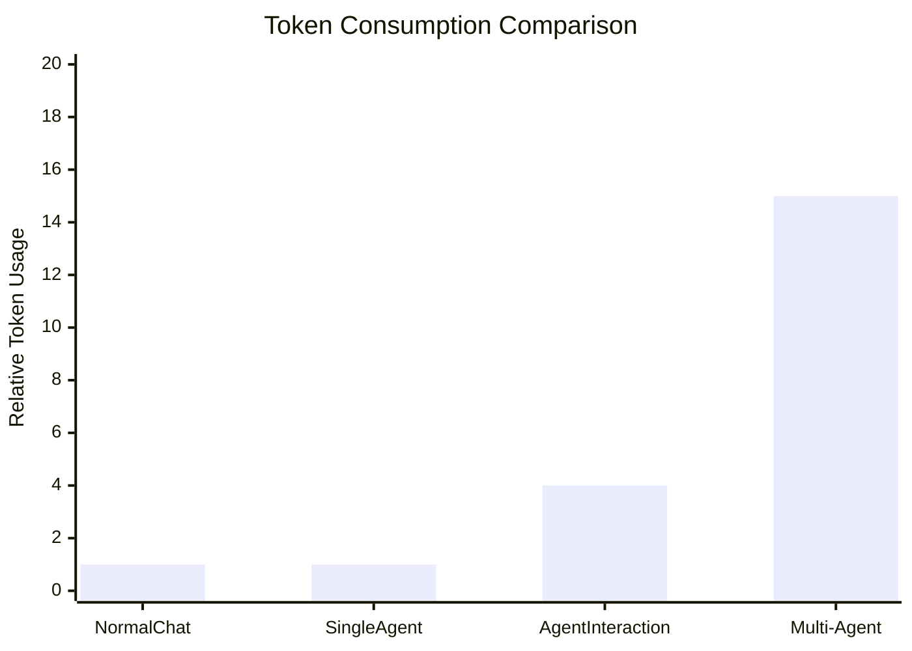

# Save Mermaid to Obsidian Chaos

将 Mermaid 图表保存到 `/Users/lionad/Github/Obsidian/Chaos/`。

## Workflow

1. **获取图表内容** - 从对话中提取 Mermaid 代码
2. **生成文件名** - 基于主题生成 `{taskname}.md`
3. **构建内容** - 使用标准 Obsidian 格式
4. **写入文件** - 路径：`/Users/lionad/Github/Obsidian/Chaos/{taskname}.md`

## 常见错误与修复

### xychart-beta 不支持中文标签

**错误：**
```
Lexical error on line 3. Unrecognized text.
x-axis [普通聊天, 单智能体, ...]
```

**修复：** 使用英文标签，在代码块下方用文字说明中文含义



**数据说明：**
- Normal Chat = 普通聊天
- Single Agent = 单智能体
- ...

### annotation 语法不支持

**错误：** xychart-beta 不支持 `annotation` 语句（Obsidian Mermaid 插件不支持）

**修复：** 移除 annotation，在代码块外用文字说明数据点

## Implementation

- 使用 `mkdir -p /Users/lionad/Github/Obsidian/Chaos` 确保目录存在
- 使用 Write 工具写入文件
